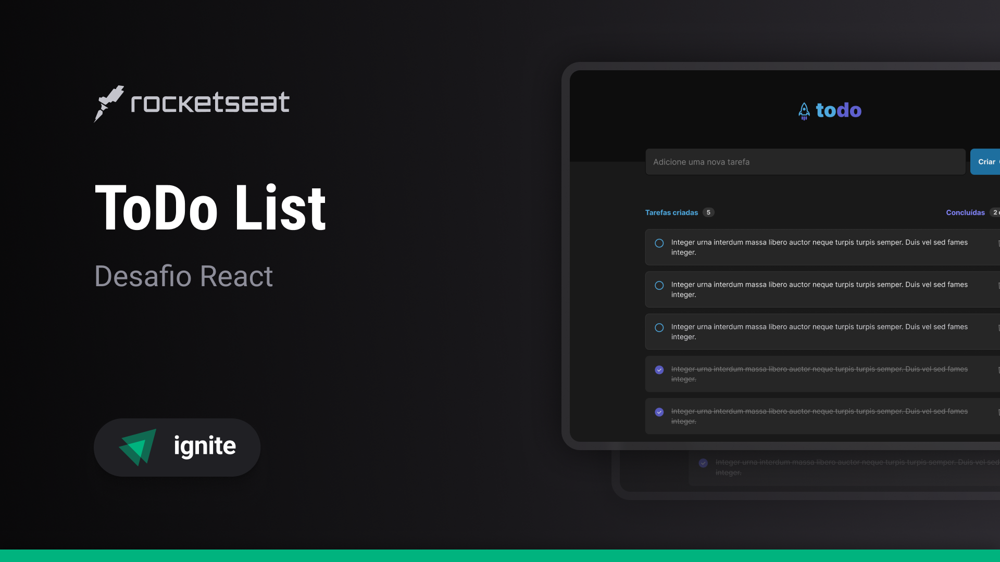

<h1 align="center"> Todo List </h1>

  <a href="#-tecnologias">Tecnologias</a>&nbsp;&nbsp;&nbsp;|&nbsp;&nbsp;&nbsp;
  <a href="#-projeto">Projeto</a>&nbsp;&nbsp;&nbsp;|&nbsp;&nbsp;&nbsp;
  <a href="#-layout">Layout</a>&nbsp;&nbsp;&nbsp;

 

  

## 🚀 Tecnologias

Esse projeto foi desenvolvido com as seguintes tecnologias:

- React
- Vite
- TypeScript
- HTML
- CSS

## 💻 Projeto

Todo List é uma página web para criação e controle de tarefas.

## 🔖 Layout

Você pode visualizar o layout do projeto através [DESSE LINK](https://www.figma.com/file/8POQVvrcMjvCjl59KFTqUV/ToDo-List?type=design&t=IwL3m5DzbeoJoy8G-0). É necessário ter conta no [Figma](https://figma.com) para acessá-lo.

## 🙋‍♀️ Autora

 

<a href="https://www.linkedin.com/in/ellen-bessa-081773253/">
 
  
 <h2><b>Ellen Bessa</b></h2>
</a>
